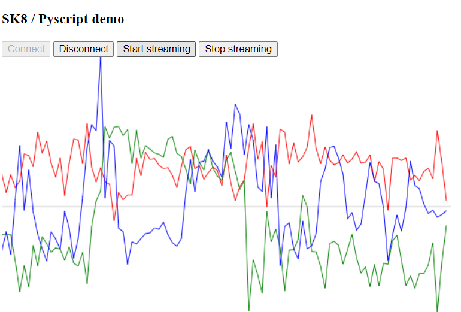

# sk8-pyscript
A simple demo of the SK8 Python code running in a [Pyscript](https://pyscript.net/) application.

# Decsription

This repo contains a Pyscript application which uses the [WebBluetooth API](https://developer.mozilla.org/en-US/docs/Web/API/Web_Bluetooth_API) to connect to an SK8 BLE sensor device. It currently supports connection/disconnection and streaming data from the IMU(s) connected to the SK8. As a simple visualization in the browser it will currently display a line graph of the values of the 3 accelerometer axes as seen in the screenshot below (red/green/blue = x/y/z). 



# Running the demo

On all platforms, Chrome is the browser which has best support for WebBluetooth.

## On a desktop

To run locally:
```sh
git clone https://github.com/idi-group/sk8-pyscript.git
cd sk8-pyscript
python -m http.server
```

Then open a browser at http://localhost:8000 

You can also try the copy hosted on pyscript.com version by browsing to https://andrewramsay.pyscriptapps.com/sk8-pyscript/latest/

## On an Android phone 

Using Chrome, browse to https://andrewramsay.pyscriptapps.com/sk8-pyscript/latest/

(note that iOS does not support WebBluetooth, although there [are some third-party efforts to fix this](https://github.com/daphtdazz/WebBLE))
